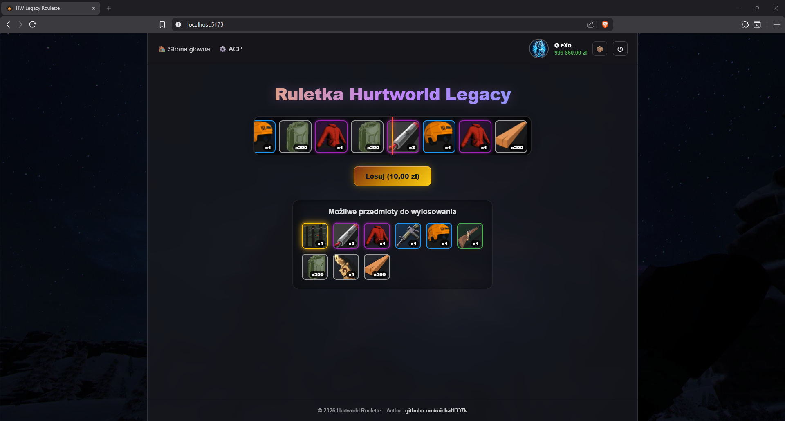
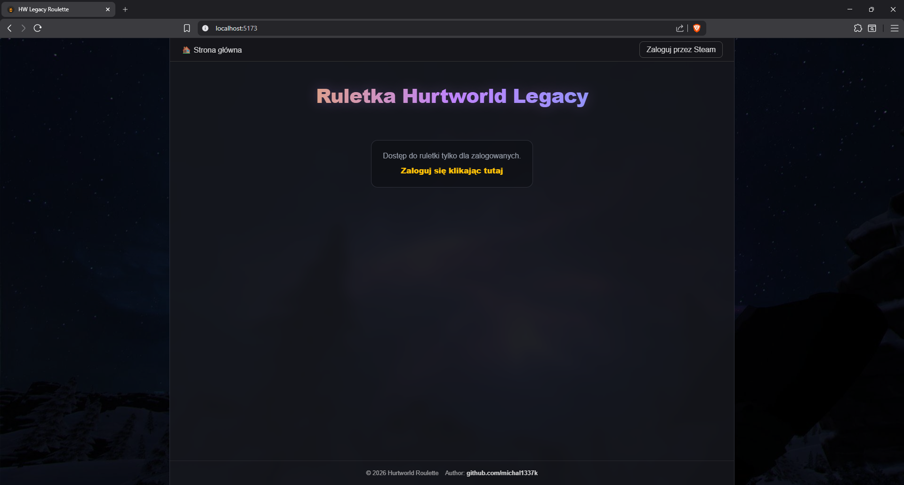
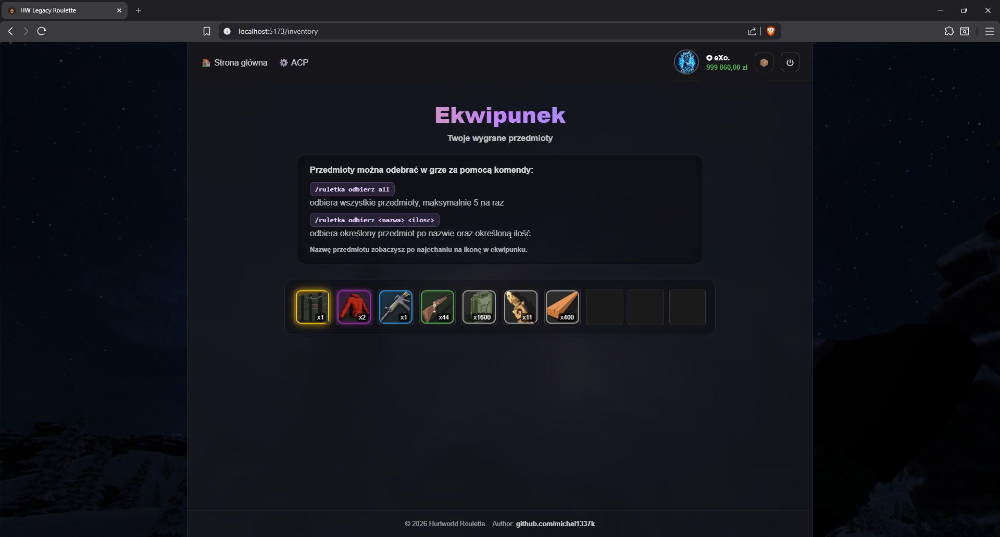
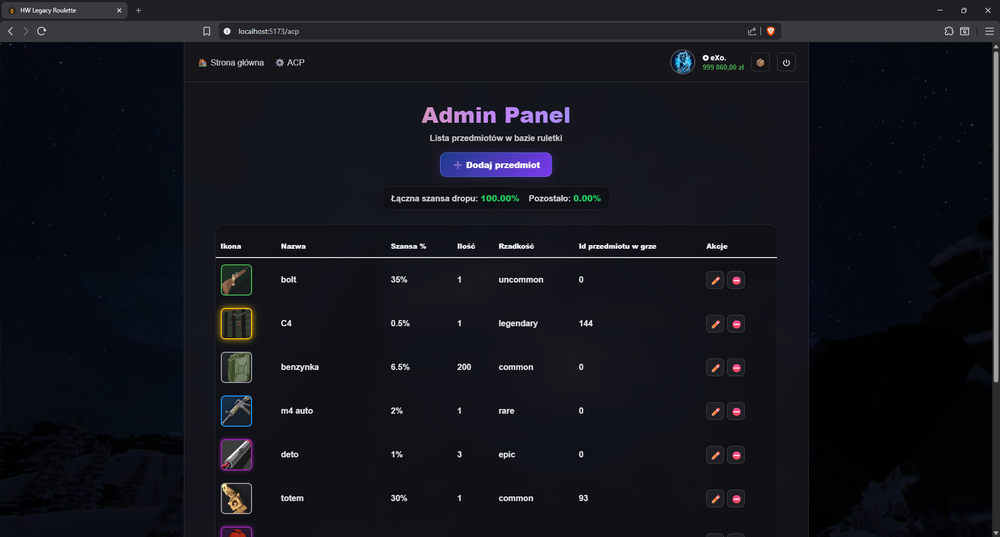
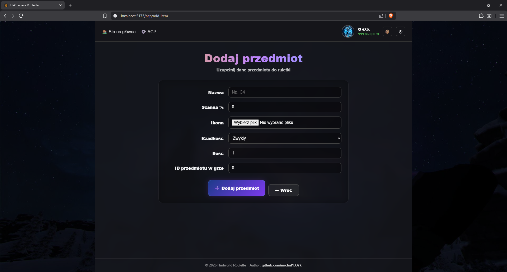

# 🎰 Hurtworld Legacy Roulette

Web application inspired by CS:GO-style roulette systems, built with **Symfony (backend)** and **Vue.js (frontend)**.

Users can roll items, manage inventory, and admins can configure drop chances via an ACP panel.

## 🚀 Technologies:
### Backend
- Symfony 6+
- PHP 8+
- Doctrine ORM
- MySQL

### Frontend
- Vue 3 (Composition API)
- Fetch API
- Custom CSS (no frameworks)

### Other
- Steam autnehtication (OpenID)
- Docker

---
## 🎥 Presentation:
👉 YouTube demo:
[didnt record this yet lol]

### 📸 Screenshots

<p align="center">
  
  
</p>

<p align="center">
  
  
</p>

<p align="center">
  
</p>

---
## ⚙️ Features
### 🎰 Roulette
- Weighted random item drops based on % chance
- Animated rolling system
- Visual rarity system (common → legendary)
- Stackable rewards (item count)

### 📦 Inventory
- Item stacking (quantity system)
- Sorted by rarity
- Tooltip with item name
- Ready for in-game claiming

### ⚙️ Admin Panel (ACP)
- Add / edit / delete items
- Configure:
  - drop chance (%)
  - rarity
  - stack count
  - game item ID
- Validation:
  - total drop chance cannot exceed 100%

---
## ⚙️ Game Integration
⚠️ You need this plugin inside your server plugin folder → [didnt write it yet lol]

Items can be redeemed in-game using commands:

``/ruletka odbierz all``

``/ruletka odbierz <nazwa> <ilosc>``

- `all` → collects up to 5 items at once
- `<nazwa>` → item name (visible on hover in inventory)

---
## 🖼️ Icons (IMPORTANT)
All game item icons are available in:
`/backend/public/all_icons`

👉 You can import them directly when creating items in the Admin Panel.

---
## 🛠️ Setup (Docker)

#### 1. Clone repo
 ```bash
  git clone https://github.com/michal1337k/hurtworld-roulette.git
  cd hurtworld-roulette
 ```
#### 2. Configure backend environment
Create bacnkend environment file:
 ```bash
cp backend/.env backend/.env.local
 ```
Then update required values in `backend/.env.local`

Required variables:
 ```env
APP_SECRET=change_me
DATABASE_URL="mysql://root:root@db:3306/roulette?serverVersion=8.3&charset=utf8mb4"
STEAM_API_KEY=your_steam_api_key
FRONTEND_URL=http://localhost:5173
VITE_API_URL=http://localhost:8080
GAME_API_TOKEN=your_game_api_token
 ```
Steam API key can be generated here:
`https://steamcommunity.com/dev/apikey`

#### 3. Configure frontend environment
Create frontend environment file:
 ```bash
cp frontend/.env frontend/.env.local
 ```
Then set backend API URL:
 ```env
VITE_API_URL=http://localhost:8080
 ```
#### 4. Start Docker
 ```bash
docker compose up -d --build
 ```
#### 5. Install backend dependencies
 ```bash
docker compose exec php composer install
 ```
#### 6. Run database migrations
 ```bash
docker compose exec php php bin/console doctrine:migrations:migrate
 ```
#### 7. Install frontend dependencies
 ```bash
docker compose exec frontend npm install
 ```
#### 8. Start frontend dev server
If your frontend container is configured for dev mode, run:
 ```bash
docker compose exec frontend npm run dev -- --host 0.0.0.0
 ```
---
## 🌐 Application URLs
- Frontend:
 ```bash
http://localhost:5173
 ```
- Backend API: 
 ```bash
http://localhost:8080
 ```

---
## 📡 API Endpoints

| Method | Path | Description | Role |
|--------|------|------------|------|
| GET | /api/inventory | Get user inventory (grouped items with quantity) | authenticated |
| POST | /api/inventory/claim | Claim item from user inventory via game_api_token | authenticated |
| GET | /api/me | Get current logged user data (profile, balance, etc.) | authenticated |
| POST | /api/roll | Roll item from roulette | authenticated |
| GET | /api/admin/items | Get all items (ACP + frontend) | admin |
| POST | /api/admin/add-item | Add new item to roulette | admin |
| POST | /api/admin/edit-item/{id} | Edit existing item | admin |
| DELETE | /api/admin/delete-item/{id} | Delete item | admin |
| GET | /login/steam | Redirect user to Steam login | anonymous |
| GET | /login/steam/check | Steam login callback (OpenID) | anonymous |
| GET | /logout | Logout user | authenticated |
| ANY | / | Frontend entry (Vue app) | public |

---
## 🖥️ CLI Commands

Application provides several Symfony console commands for managing users.
- `steamid` must be a valid SteamID64
- `amount` is always in cents (1000 = 10.00$)
- Commands are intended for admin/dev usage only
  
### 💰 Add balance

Adds balance to a user (increments current value):

```bash
php bin/console app:add-balance <steamid> <amount>
```

Example:
```bash
php bin/console app:add-balance 76561198000000000 1000
```
➡️ Adds 10.00$ (amount is in cents)

### 🏦 Set balance
Sets exact balance value (overwrites current):

```bash
php bin/console app:set-balance <steamid> <amount>
```

Example:
```bash
php bin/console app:set-balance 76561198000000000 5000
```
➡️ Sets balance to 50.00$

### 👑 Make admin
Grants admin role to a user:

```bash
php bin/console app:make-admin <steamid>
```

Example:
```bash
php bin/console app:make-admin 76561198000000000
```
➡️ Adds `ROLE_ADMIN` to user

### 📦 Clear user inventory
Delete items in user inventory:

```bash
php bin/console app:clear-inventory <steamid>
```

Example:
```bash
php bin/console app:clear-inventory 76561198000000000
```
➡️ Delete every item in user inventory


---
## Author
Github 👉 https://github.com/michal1337k

## 📄 License

This project is open-source and free to use for educational and personal purposes.

Feel free to use, modify, and build upon it.

No warranty is provided.


